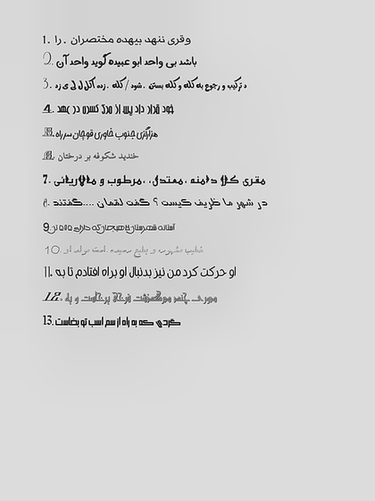
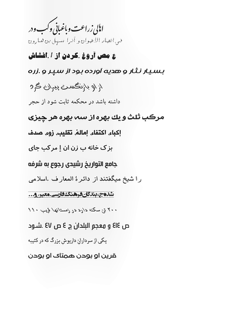

# Synthetic Persian OCR Data Generator

A high-fidelity synthetic image-text dataset generator specifically designed for Persian OCR and vision-language model training. This tool produces realistic document-like images with diverse Persian text content, enabling robust model development for Persian language understanding and optical character recognition tasks, especially when real annotated data is scarce or unavailable. It is particularly useful for data augmentation, allowing the creation of large, varied training datasets to improve model generalization.

## Overview

Developing effective Persian OCR systems requires diverse, high-quality training data that captures the linguistic and visual complexity of real-world documents. This generator addresses the scarcity of annotated Persian text data by synthesizing document images with controlled variations in typography, layout, and appearance. By producing fully annotated, realistic images, it enables scalable training of vision-language models for Persian text understanding.

The system is particularly valuable for low-resource Persian language processing, providing a flexible framework to generate training data that mimics real document characteristics while maintaining full control over annotations. This makes it ideal for both augmenting existing datasets and training models from scratch when real data is limited or unavailable.

## Key Features

Persian language focus – Primary support for Persian (Farsi) script with integrated English and numeric content

Realistic document simulation – Generates authentic-looking document layouts with proper text formatting

Comprehensive visual variation – Randomized fonts, colors, background textures, and geometric transformations

Advanced image processing – Implements conformal warping, CLAHE enhancement, and adaptive sharpening

Multi-orientation support – Includes 0°, ±90°, and 180° rotations for orientation-invariant training

Training-ready implementation – Provides complete PyTorch Dataset and Collator classes

Dots.OCR compatibility – Specifically designed for integration with Persian OCR training frameworks

Scalable data generation – Configurable sample counts with reproducible randomization

## Technical Architecture

### Text Generation Pipeline

Persian text sourcing – Utilizes the Dehkhoda corpus for authentic Persian language content

Mixed-language composition – Intelligently combines Persian, English, and numerical elements

Bidirectional text handling – Proper management of Persian right-to-left text flow

Document structure simulation – Creates realistic document hierarchies and formatting

### Visual Synthesis Pipeline

Text rendering – High-quality rendering with diverse Persian and English typefaces

Layout composition – Dynamic positioning and formatting of document elements

Geometric distortion – Application of conformal warping for natural document curvature

Background integration – Seamless blending with texture backgrounds

Image enhancement – Contrast enhancement and sharpening for OCR-optimized images

Orientation randomization – Multi-angle rotation for robustness training

### Data Management

CSV-based text sourcing – Flexible input format for diverse text corpora

Structured output organization – Systematic file naming and directory organization

Annotation preservation – Complete text preservation with proper encoding


## Installation

### Project Structure

```text
├── main.py                 # Primary dataset generation and visualization
├── data_loader.py          # PyTorch Dataset and Collator implementations
├── requirements.txt        # Python dependencies
├── dehkhoda.csv            # Persian text corpus (Dehkhoda dataset)
├── backgrounds/            # Background texture images
├── fonts/                  # Typography resources
│   ├── persian_fonts/      # Persian-compatible typefaces
│   └── english_fonts/      # English typefaces
├── generated_data/         # Output directory
│   ├── images/             # Generated document images
│   └── labels/             # Corresponding text annotations
└── results/                # Sample outputs and visualizations
```

### Prerequisites

Python 3.8+

PyTorch (≥1.9.0)

Pillow for image processing

OpenCV for advanced image transformations

### Setup

```bash
# Clone repository
git clone https://github.com/imaryamsamani-lang/Image-Data-Generator.git
cd Image-Data-Generator

# Install Python dependencies
pip install -r requirements.txt
```

### Resource Acquisition

Persian Fonts
Download and extract Persian-compatible fonts into fonts/persian_fonts/: [Persian Fonts](https://drive.google.com/file/d/18JBa3f-4_tw2MgDiW6Po_-ydDdW11_8S/view?usp=drive_link)

English Fonts
Place English typefaces in fonts/english_fonts/: [English Fonts](https://drive.google.com/file/d/1YoSQN6qhEtqpdI-x6ONxn7EAUW70fJ8q/view?usp=sharing)


Background Textures
Add background images to backgrounds/ for document texturing: [Background Images](https://drive.google.com/file/d/1GsIPEeqV_rzKYY6nsR-Rcxj9vz9AB1V2/view?usp=sharing)

Text Corpus (Dehkhoda Dataset)
Download the Persian text corpus for content generation: [dehkhoda.csv](https://drive.google.com/file/d/1mxMMTlPqATtShRoDYpgJdfcDarQIEjir/view?usp=drive_link)

### Input Data Format

The generator utilizes a CSV file containing Persian text samples. The Dehkhoda dataset format is:


```text

0 بسم الله الرحمن الرحيم

1	کتابخانه

2	اسلامی المعارف بنسیاد دایرة

3	روه ادبات

4	به قلم گروهی از نویسندگان

... ...
3704188	پایان
```

Custom CSV files can be used provided they follow this two-column structure with UTF-8 Persian text content.

## Usage

### Data Generation

Generate a synthetic dataset of document images with annotations:

```bash
python main.py --save --output_path generated_data --max_samples 1000
```
Command-line Arguments:

--save: Enable saving generated data to disk

--output_path: Directory for output storage (default: generated_data)

--max_samples: Number of samples to generate

--csv_path: Path to text corpus CSV (default: dehkhoda.csv)

--image_size: Output image dimensions as "width,height" (default: 512,512)

--visualize: Preview generated samples without saving

### Output Structure

The generator produces organized output directories:

```text
generated_data/
├── images/                 # Document images in PNG format
│   ├── 0000.png
│   ├── 0001.png
│   └── ...
└── labels/                # Text annotations in UTF-8 encoding
    ├── 0000.txt
    ├── 0001.txt
    └── ...
```

Each annotation file contains the complete Persian text content exactly as rendered in the corresponding image.

### Visualization Mode

Preview generated samples with text overlays for verification:

```bash
python main.py --visualize --num_samples 5
```

### Data Format

Each generated sample is structured as a dictionary compatible with vision-language training:

```python
{
    "image": PIL.Image,          # Document image in RGB format
    "answer": str,              # Complete Persian text content
    "prompt_only": str,         # Instruction prompt for OCR task
    "text_full": str            # Combined prompt and response text
}
```

This format supports both:

Direct OCR training – Using image-answer pairs for text recognition

Instruction-following training – Using prompt-response formatting for conversational OCR

## Training Integration

### PyTorch Dataset

The provided data_loader.py implements a complete PyTorch Dataset:

```python
from data_loader import DotsOcrJsonl, Collator
processor = #Placeholder processor (load later)

# Dataset
data_train = DotsOcrJsonl(df, processor, "train")
```

### Data Collator

The custom Collator handles:

Vision feature extraction – Image preprocessing and normalization

Token masking – Proper handling of instruction-response formatting

Persian tokenization – Specialized handling of Persian text encoding

Batch preparation – Efficient batching with padding and attention masks

### Dots.OCR Framework Compatibility

The data format aligns with Persian OCR training requirements:

Support for special tokens (<|assistant|>, <|end|>)

Proper handling of Persian bidirectional text

Vision encoder feature compatibility

Causal language modeling training format

## Sample Outputs




## Performance Considerations

### Text Quality

Persian text preservation – Text is saved in standard Unicode order without reshaping

Font compatibility – All Persian fonts are verified for glyph coverage

Encoding integrity – UTF-8 encoding ensures proper character preservation

### Image Quality

Resolution scaling – Images are generated at specified dimensions with quality preservation

Contrast optimization – Automatic contrast adjustment for OCR readability

Background variability – Diverse textures prevent overfitting to specific backgrounds

### Generation Speed

Batch processing – Efficient generation with configurable batch sizes

Resource optimization – Memory-efficient image processing pipeline

Parallelization support – Designed for potential multi-process generation

## Important Notes

### Text Handling Guidelines

Do NOT reshape Persian text – The arabic_reshaper is used only for visual rendering; annotations preserve logical character order

Font requirements – Ensure Persian fonts contain necessary glyphs for complete rendering

Corpus quality – Text diversity directly impacts model generalization capability

### Image Generation Parameters

Background resolution – Use high-resolution backgrounds (≥1024×1024) for best results

Font scaling – Dynamic font sizing based on content length and image dimensions

Distortion control – Geometric distortion levels are calibrated for realism without excessive degradation

### Limitations and Considerations

Synthetic nature – Generated data may not capture all real-world document variations

Domain adaptation – For specific document types (receipts, forms, manuscripts), consider domain-specific generation parameters

Real data supplementation – For production systems, combine synthetic data with real annotated documents
